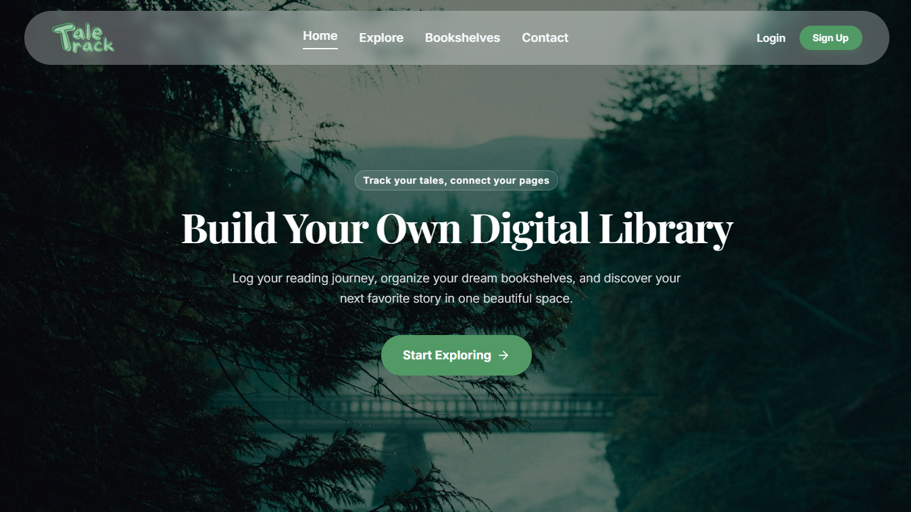
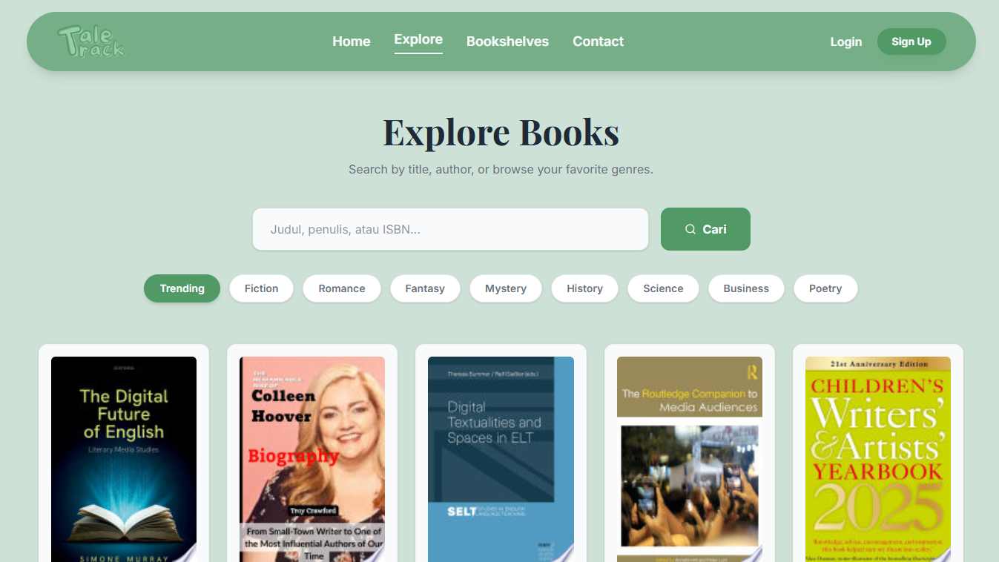
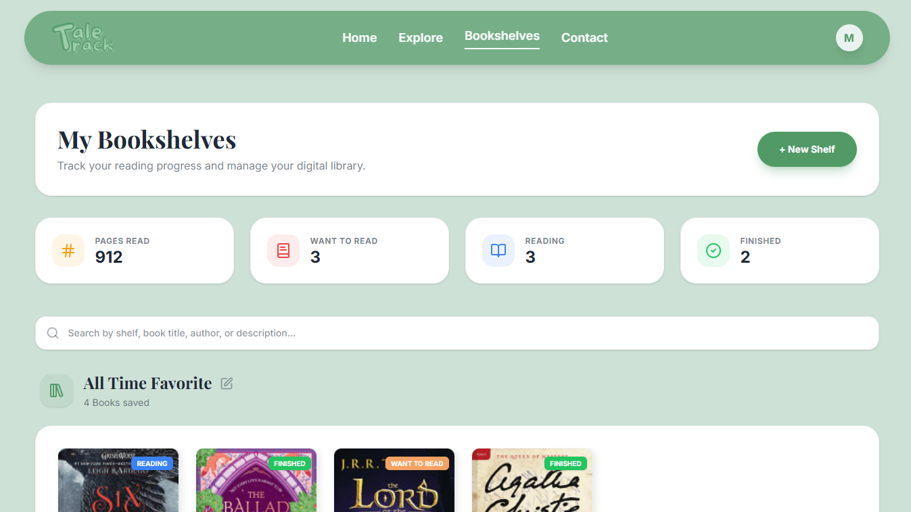

<div align="center">
  

**Track your tales, connect your pages.**

A personal digital catalog to track your reading progress, manage your dream bookshelves, and discover your next unforgettable story.

[](https://nextjs.org/)
[](https://www.typescriptlang.org/)
[](https://tailwindcss.com/)
[](https://www.prisma.io/)
[](https://supabase.com/)

<h3>
    Visit the website at <a href="https://tale-track.vercel.app/">https://tale-track.vercel.app/</a>
  </h3>
</div>

## Preview

<p align="center">
  
  
  
</p>

## Features

- **Endless Discovery:** Search millions of titles from global databases via the Google Books API. Browse by trending books, authors, or your favorite genres.
- **Custom Bookshelves:** Curate personalized collections. Group books by genre, mood, favorites, or create your own custom categories.
- **Reading Tracker:** Log your daily pages, track your reading progress with dynamic progress bars, and update book statuses (Want to Read, Reading, Finished).
- **Secure Authentication:** Seamless login/signup experience using Auth.js (NextAuth v5), including email password resets and secure session management.
- **PWA Ready (Offline Support):** Install TaleTrack on your mobile device as a Progressive Web App. Cached pages remain accessible even when you lose your internet connection.
- **Modern & Responsive UI:** A beautifully crafted, fully responsive design using Tailwind CSS with smooth animations and intuitive interactions.

## Tech Stack

**Frontend:**

- [Next.js](https://nextjs.org/) (App Router, Turbopack)
- [React](https://reactjs.org/)
- [Tailwind CSS](https://tailwindcss.com/)
- [Lucide React](https://lucide.dev/) (Icons)
- [Next PWA](https://github.com/ducanh2912/next-pwa) (Service Worker & Offline Support)

**Backend & Database:**

- [Prisma ORM](https://www.prisma.io/)
- [Supabase](https://supabase.com/) (PostgreSQL Database)
- [Auth.js / NextAuth v5](https://authjs.dev/) (Authentication)
- [Nodemailer](https://nodemailer.com/) (Password Reset Emails)

**External APIs:**

- [Google Books API](https://developers.google.com/books)

## Project Structure

Project Structure

```text
tale-track/
├── app/
│   ├── (frontend)/
│   │   ├── explore/
│   │   ├── shelves/
│   │   ├── contact/
│   │   └── page.tsx
│   ├── actions/
│   ├── api/
│   ├── ~offline/
│   ├── layout.tsx
│   └── globals.css
├── components/
├── lib/
├── public/
├── prisma/
├── middleware.ts
└── next.config.ts
```

## Run Locally

Follow these steps to run TaleTrack on your local machine

1. Clone the repository

   ```bash
   git clone https://github.com/arimbiws/tale-track.git
   cd tale-track
   ```

2. Install dependencies\
   (Note: Using --legacy-peer-deps to bypass beta dependency warnings with Auth.js v5)

   ```bash
   npm install --legacy-peer-deps
   ```

3. Set up environment variables\
   Create a .env file in the root directory and configure it based on your credentials:

   ```bash
    DATABASE_URL="your_supabase_pool_url"
   DIRECT_URL="your_supabase_direct_url"

   AUTH_SECRET="your_generated_secret"
   AUTH_URL="http://localhost:3000"
   AUTH_TRUST_HOST=true

   GOOGLE_BOOKS_API_KEY="your_google_api_key"
   GOOGLE_CLIENT_ID="your_google_client_id"
   GOOGLE_CLIENT_SECRET="your_google_client_secret"

   EMAIL_USER="your_email@gmail.com"
   EMAIL_PASS="your_app_password"
   ```

4. Initialize the Database
   ```bash
   npx prisma db push
   ```
5. Start the development server

   ```bash
   npm run dev
   ```

   Navigate to http://localhost:3000 to view it in your browser.

## Future Improvements

- **Community Book Reviews**: Allow users to write reviews, rate books, and share them publicly
- **Reading Challenges**: Let users set yearly reading goals (e.g., "Read 50 books in 2026") with visual milestones.
- **Social Features**: Follow friends, see their reading activity, and share book recommendations.

<hr/>

<div align="center">
<p>Made with ♡ by a reader, for readers.</p>
</div>
